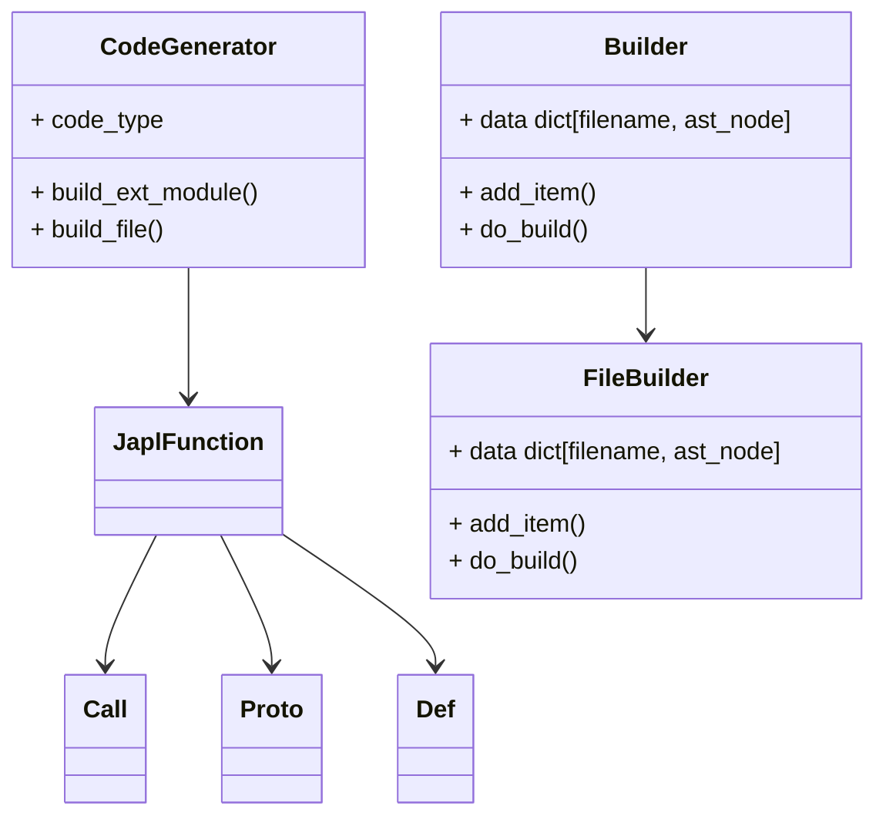

CodeGenerator module is implemented as a Builder software pattern

```mermaid
classDiagram
    CodeGenerator --> JaplFunction
    JaplFunction --> Call
    JaplFunction --> Proto
    JaplFunction --> Def
    Builder --> FileBuilder
    class CodeGenerator {
        + code_type
        + build_ext_module()
        + build_file()
    }
    class Builder {
        + data dict[filename, ast_node]
        + add_item()
        + do_build()
    }
    class FileBuilder {
        + data dict[filename, ast_node]
        + add_item()
        + do_build()
    }
```
